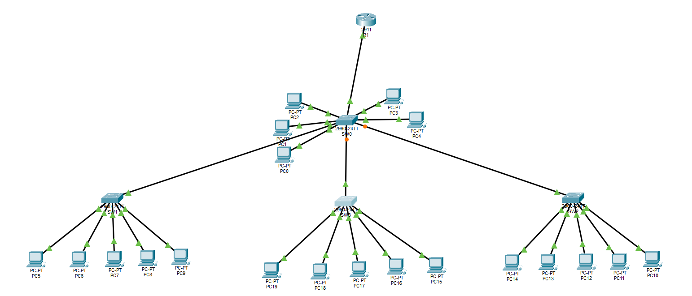

<!-- ================= HEADER ================= -->

<div align="center">

<br>


<br><br>


</div>

---

# 🌐 VLAN & Inter-VLAN Communication Network

> 🚀 A Cisco Packet Tracer project demonstrating **VLAN segmentation, trunking, IP addressing, routing, and Inter-VLAN communication**.

---

## 📌 Project Overview

This project demonstrates how a network can be divided into multiple **Virtual LANs (VLANs)** and how devices belonging to different VLANs can communicate through **Inter-VLAN routing**.

The complete network was designed and tested using **Cisco Packet Tracer**.

### 🔧 Network Components

| Component | Quantity |
|---|---:|
| 💻 PCs | 20 |
| 🔀 Cisco 2960 Switches | 4 |
| 🌐 Cisco 2811 Router | 1 |
| 🏷️ VLANs | 4 |

---

# 🖧 Network Topology

The network contains four Cisco 2960 switches and one Cisco 2811 router.

The switches are connected in an extended-star arrangement, with **SW0 acting as the central switch**.

### 💻 PC Distribution

| Switch | Connected PCs |
|---|---|
| 🔵 SW0 | PC0 – PC4 |
| 🟢 SW1 | PC5 – PC9 |
| 🟡 SW2 | PC10 – PC14 |
| 🔴 SW3 | PC15 – PC19 |

### 📷 Topology Diagram



---

# 🏷️ VLAN Configuration

VLANs allow a physical network to be logically divided into separate broadcast domains.

The VLANs configured in the project are:

| VLAN ID | VLAN Name |
|---:|---|
| 10 | `sw0_NETWORK` |
| 20 | `sw1_NETWORK` |
| 30 | `sw2_NETWORK` |
| 40 | `sw3_NETWORK` |

### 🎯 Purpose of VLANs

VLANs provide:

- 🔒 Network segmentation
- 📡 Broadcast-domain separation
- 🛠️ Easier network management
- 📊 Better network organization
- 🌐 Logical separation of devices

---

# 🔗 Trunking

A **trunk link** allows traffic from multiple VLANs to travel across a single network link.

The trunk configuration on SW0 was verified using:

```text
show interfaces trunk
